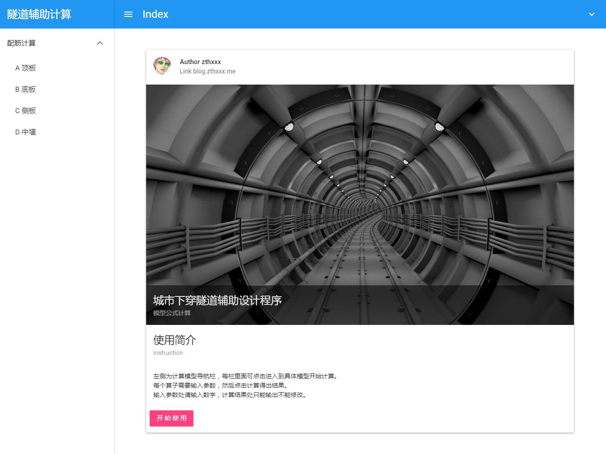
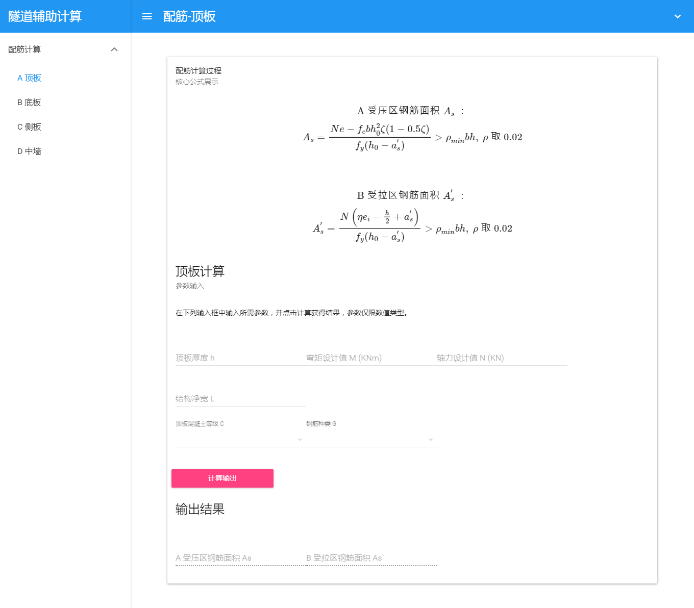
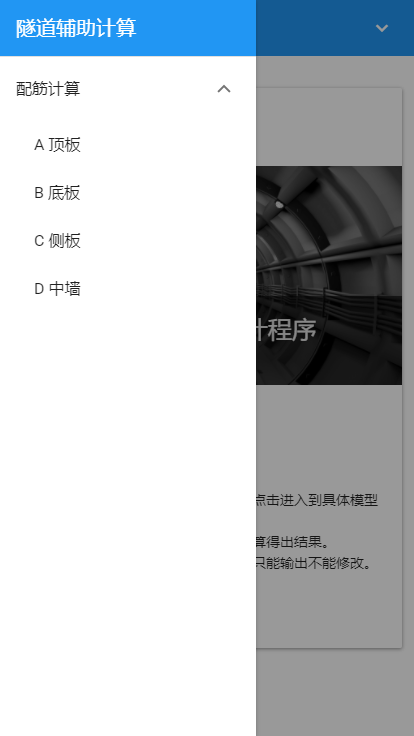
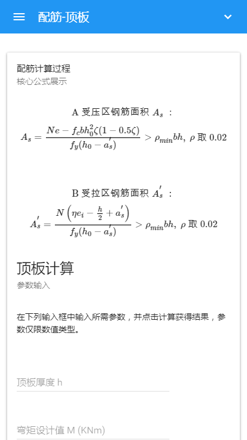

# Tunnel Assist

[](https://travis-ci.org/zthxxx/TunnelAssist)

> A SPA for assist calculate tunnel model by Vue2.

It like a dedicated formula calculator, you can input some params, and then, it will calculate result with appointed model formula.

The page u can see at [https://tunnel.zthxxx.me/#/](https://tunnel.zthxxx.me/#/)

Using [Muse-UI](http://www.muse-ui.org/#/index) for Material Design.

## Preview





 


## Build Setup

``` bash
# install dependencies
npm install

# serve with hot reload at localhost:8080
npm run dev

# build for production with minification
npm run build

# publish on gh-pages
# u need install ghp-import at first
npm run publish
```


## License

GPL